# Fetal Ultrasound Analysis: Landmark Detection & Segmentation

This repository contains a comprehensive research solution for Fetal Ultrasound Biometry, addressing two distinct tasks derived from the same medical imaging dataset:
1.  **Task 1: Landmark Detection** (Detecting BPD and OFD points)
2.  **Task 2: Skull Boundary Segmentation** (Extracting geometric measurements via segmentation)

## Project Overview

The goal of this project is to automate the extraction of standard fetal biometry measurements—Biparietal Diameter (BPD) and Occipitofrontal Diameter (OFD)—which are critical for estimating gestational age and fetal weight. We approach this problem from two angles: a direct landmark localization approach using heatmap regression, and a geometric approach involving skull boundary segmentation and ellipse fitting.

### Directory Structure

```
Submission_Output/
├── task_1_landmark_detection/  # Solution for Task 1 (Heatmap Regression)
│   ├── models/                 # Saved model weights
│   ├── pythonscripts/          # Source code (trainer, models, utils)
│   ├── report/                 # Detailed analysis reports
│   └── README.md               # Task-specific documentation
├── task_2_segmentation/        # Solution for Task 2 (Boundary Segmentation)
│   ├── models/                 # Saved model weights
│   ├── pythonscripts/          # Source code (geometry, inference, train)
│   ├── report/                 # Detailed analysis reports
│   └── README.md               # Task-specific documentation
├── requirements.txt            # Python dependencies
└── README.md                   # This file
```

*(Note: Data and images are expected to be in `../datasets` and `../images` relative to this folder during development)*

---

## Part 1: Exploratory Data Analysis (EDA)

Before modeling, we conducted an extensive analysis of the dataset to understand image characteristics and label quality.

### Image Characteristics
The dataset consists of fetal ultrasound images with varying contrast and noise levels.
*   **Intensity & Contrast:** We analyzed the global pixel intensity (Fig 1) and per-image contrast (Fig 2). The data shows significant variance, motivating the use of **Per-Image Z-Score Normalization** over global min-max scaling.
*   **Foreground Ratio:** Fig 4 highlights the variability in head size relative to the canvas.

| Intensity Distribution | Contrast Analysis | Low vs High Contrast | Foreground Ratio |
|:---:|:---:|:---:|:---:|
| 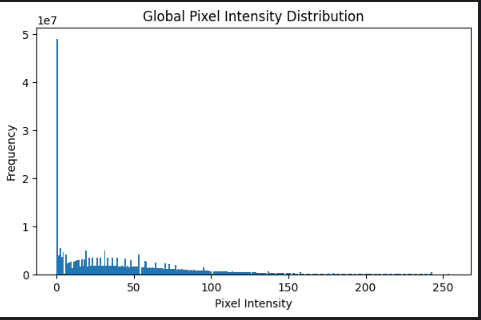 | 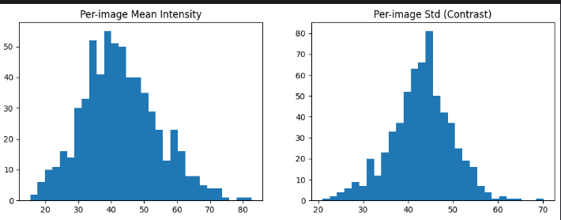 | 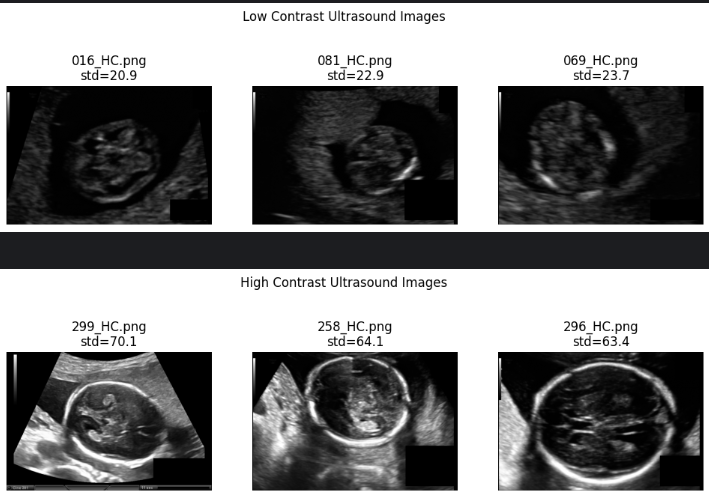 | 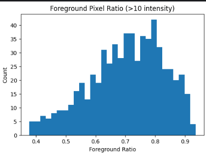 |
| *Fig 1: Global Pixel Intensity* | *Fig 2: Per-image Mean/Std* | *Fig 3: Contrast Variability* | *Fig 4: Foreground Ratio* |

### Label Quality and Anomalies
A critical discovery during EDA was the presence of noisy and inconsistent labels.
*   **Spatial Distribution:** Fig 5 shows the density of BPD vs OFD points.
*   **Label Swapping:** By analyzing the orientation angles (Fig 6, Fig 9), we discovered that **BPD and OFD labels were swapped** in a significant portion of the dataset (indicated by orthogonality checks).
*   **Anomaly Detection:** We used a Mahalanobis-distance based score to identify and filter anomalous labels (Fig 7, Fig 8).

| Landmark Density | Orientation Angles | Anomaly Scores | Improper Labels | Label Swapping |
|:---:|:---:|:---:|:---:|:---:|
| 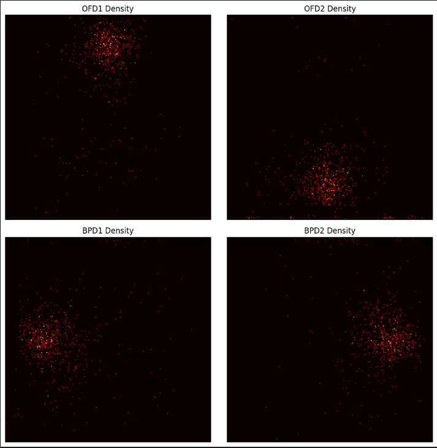 | 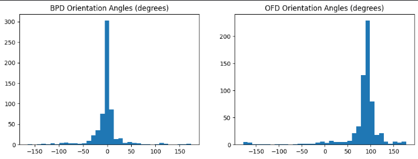 | 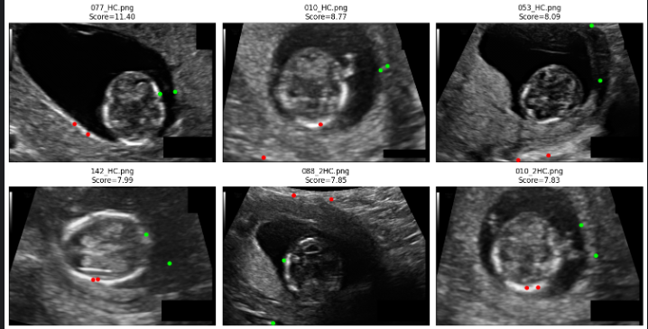 | 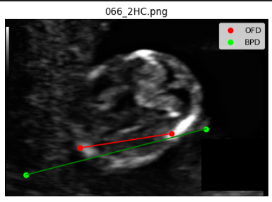 | 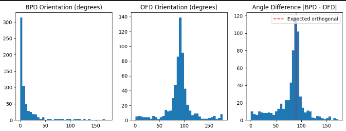 |
| *Fig 5: Landmark Distribution* | *Fig 6: Orientation Angle* | *Fig 7: Anomaly Detection* | *Fig 8: Improper Example* | *Fig 9: Orientation & Orthogonality* |

---

## Part 2: Task 1 - Landmark Detection

**Objective:** Directly regress the coordinates of 4 landmarks (2 for BPD, 2 for OFD).

### Methodology Evolution
1.  **Baseline: Coordinate Regression**
    *   We started with a simple CNN directly regressing (x, y) coordinates.
    *   **Result:** While training converged (Fig 10), predictions were unstable and sensitive to noise (Fig 11).

| Coordinate Regression Training | Visual Results (Coord Reg) |
|:---:|:---:|
| 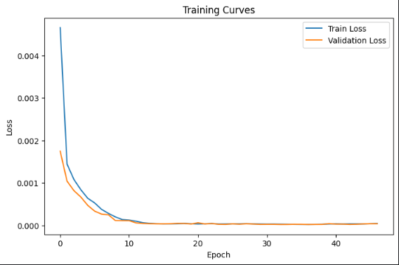 | 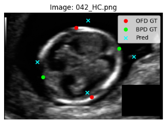 |
| *Fig 10: Loss Curve* | *Fig 11: Prediction vs GT* |

2.  **Advanced: Heatmap Regression (HRNet / U-Net)**
    *   We shifted to predicting Gaussian likelihood heatmaps for each landmark. This preserves spatial context and represents uncertainty naturally.
    *   **Architecture:** We utilized **HRNet** and **U-Net** variants.
    *   **Loss Function:** MSE coupled with a custom **Angle Consistency Loss** to enforce the geometric orthogonality of BPD and OFD axes.
    *   **Result:** Significantly improved localization accuracy and stability.

| HRNet Training | Heatmap Visualization 1 | Heatmap Visualization 2 |
|:---:|:---:|:---:|
| 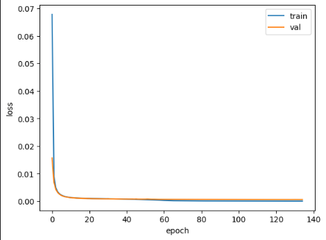 | 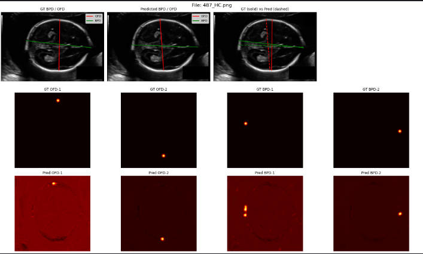 | 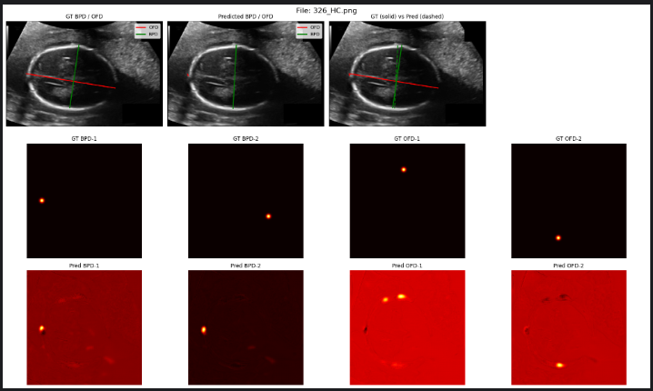 |
| *Fig 12: Heatmap Loss* | *Fig 13: Accurate Localization* | *Fig 14: Handling Ambiguity* |

---

## Part 3: Task 2 - Segmentation & Geometric Analysis

**Objective:** Segment the fetal skull and derive landmarks using geometric fitting (Ellipse Fitting).

### Problem Reformulation
Initial attempts at standard semantic segmentation (Foreground vs Background) failed due to the thin, boundary-like nature of the skull in ultrasound images (Fig 15).
*   **Pivot:** We reformulated the task as **Skull Boundary Segmentation**.
*   **Geometry:** We analyzed skull area (Fig 16), eccentricity (Fig 17), and orientation (Fig 18) to inform our augmentation strategy.

| Ultrasound vs Mask | Skull Area | Skull Eccentricity | Orientation Distribution |
|:---:|:---:|:---:|:---:|
| 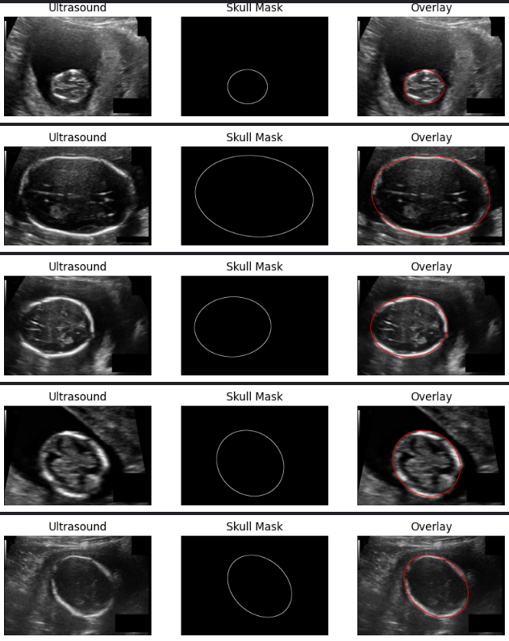 | 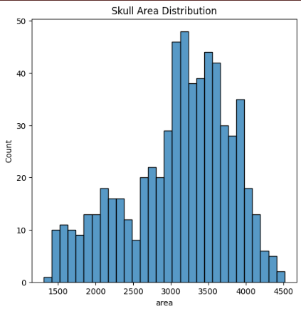 | 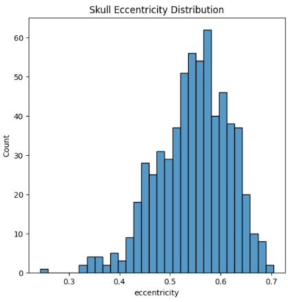 | 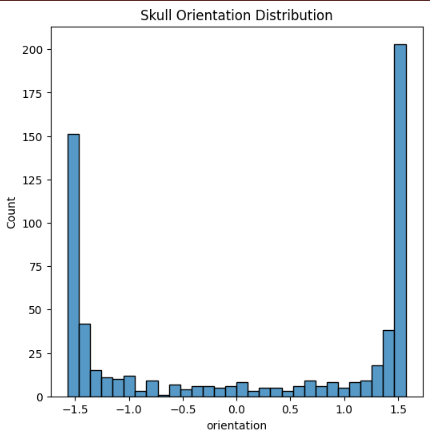 |
| *Fig 15: Boundary Nature* | *Fig 16: Area Distribution* | *Fig 17: Shape Analysis* | *Fig 18: Orientation Bias* |

### Hypotheses & Experiments
We tested 4 specific hypotheses to improve boundary detection:
1.  **Baseline:** Standard U-Net, 256x256, 1px boundary.
2.  **Hypothesis 1 (High Res):** 512x512 input.
3.  **Hypothesis 2 (Thick Boundary):** 3px target width to handle annotation uncertainty.
4.  **Hypothesis 3 (Augmentation):** Geometric augmentations (Rotation/Translation) to handle orientation variance.
5.  **Hypothesis 4 (Post-processing):** Morphological closing + Largest Component extraction (Inference only).

| Preprocessing Comparison | Model Predictions | Hypothesis Comparison | Hypothesis 2/3 Result |
|:---:|:---:|:---:|:---:|
| 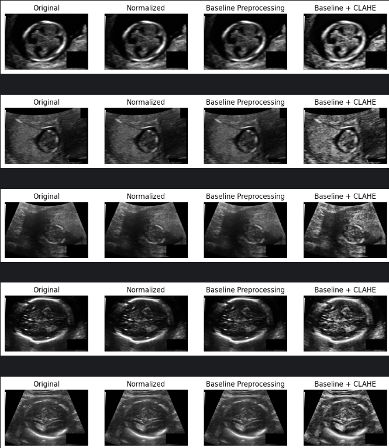 | 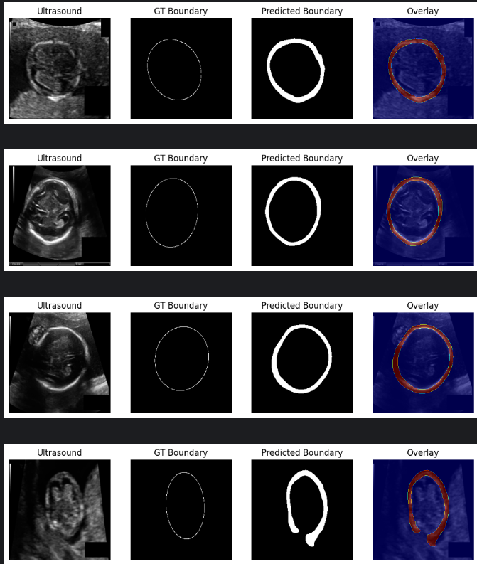 | 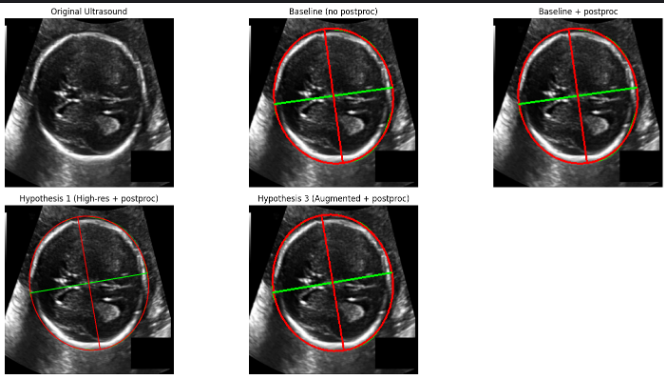 | 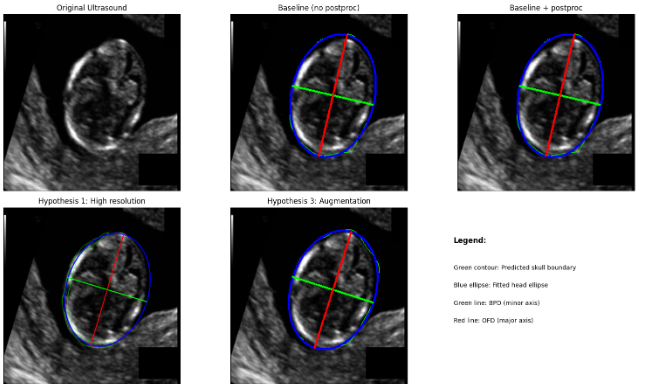 |
| *Fig 19: Preprocessing* | *Fig 20: Predicted Boundaries* | *Fig 21: Model Comparison* | *Fig 22: Model Metrics* |

---

## Usage Instructions

All commands are to be run from the `Submission_Output` directory.

### Prerequisites
Install dependencies:
```bash
pip install -r requirements.txt
```

### Task 1: Landmark Detection

**Training:**
```bash
python -m task_1_landmark_detection.pythonscripts.trainer \
    --data_csv ../datasets/task_1/role_challenge_dataset_ground_truth.csv \
    --image_dir ../datasets/task_1/images
```

**Evaluation:**
```bash
python -m task_1_landmark_detection.pythonscripts.tester \
    --data_csv ../datasets/task_1/role_challenge_dataset_ground_truth.csv \
    --image_dir ../datasets/task_1/images \
    --weights_path task_1_landmark_detection/models/best_multi_head_model.pth
```

### Task 2: Segmentation

**Training (Select Hypothesis):**
```bash
# Baseline
python -m task_2_segmentation.pythonscripts.train \
    --data_dir ../datasets/task_2/images \
    --mask_dir ../datasets/task_2/masks \
    --hypothesis baseline

# Hypothesis 3 (Augmented)
python -m task_2_segmentation.pythonscripts.train \
    --data_dir ../datasets/task_2/images \
    --mask_dir ../datasets/task_2/masks \
    --hypothesis hyp3
```

**Evaluation & Visualization:**
```bash
python -m task_2_segmentation.pythonscripts.test \
    --data_dir ../datasets/task_2/images \
    --model_path task_2_segmentation/models/hyp3_augmented_boundary_unet.pt \
    --use_postprocessing \
    --visualize
```
